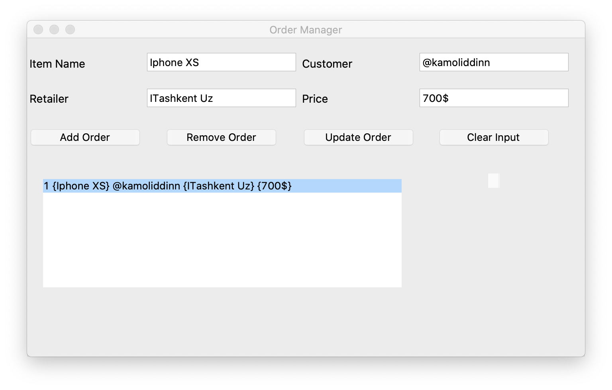

# Order_Manager

Python/Tkinter GUI app to manage orders.
Made to practice Tkinter and sqlite3

### Dependencies

```
Tkinter
Sqlite3
```

### Make executable using Pyinstaller

```
# Windows
pyinstaller --onefile --windowed part_manager.py

# MacOS
pyinstaller --onefile --add-binary='/System/Library/Frameworks/Tk.framework/Tk':'tk' --add-binary='/System/Library/Frameworks/Tcl.framework/Tcl':'tcl' part_manager.py
```

### Functions

```
1) Add order
2) Remove order
3) Update order
4) Clear text input area
```

### Note !
Project was made to practice Tkinter after watching https://www.youtube.com/watch?v=ELkaEpN29PU&list=PLillGF-RfqbbJYRaNqeUzAb7QY-IqBKRx&index=6
Original repository: https://github.com/bradtraversy/part_manager

# Screenshot of application GUI 

